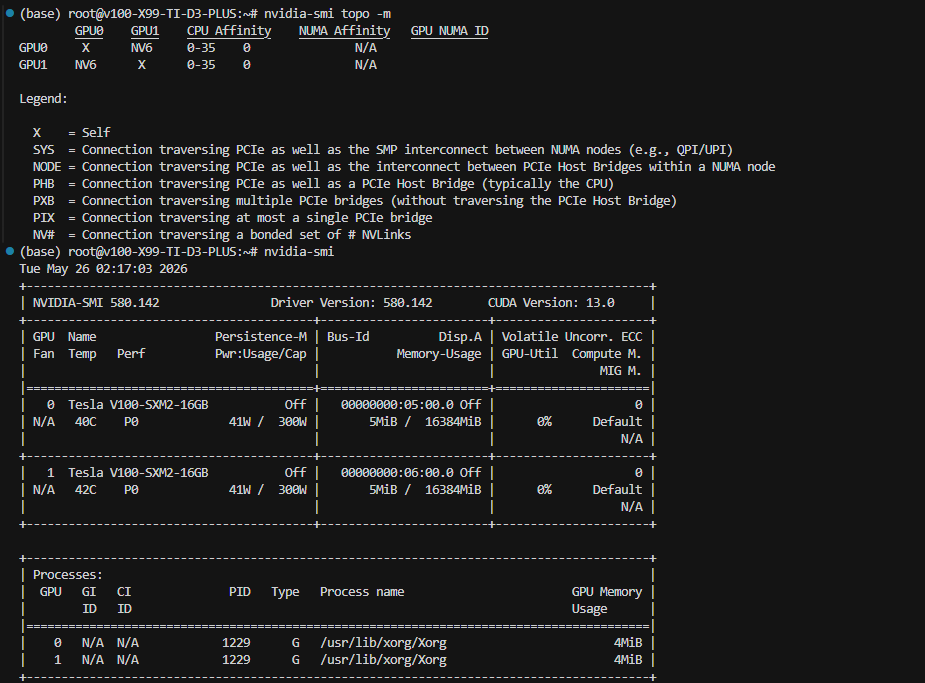
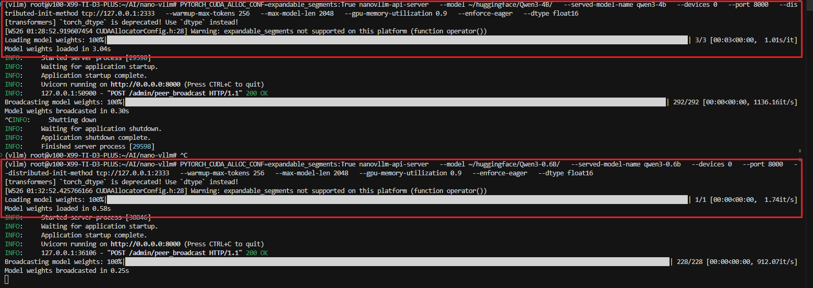
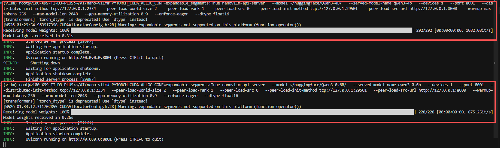

# Nano-vLLM 修改说明

原始 README 已保存为 `README_old.md`。当前文档记录本次在 `/root/AI/nano-vllm` 上完成的主要改造：V100 适配、FastAPI 推理服务、指定 GPU/TP 参数、模型加载进度统计，以及第二套实例从已有实例通过 P2P/NCCL 加载权重。

## 主要改动

- `flash-attn` 改为可选依赖，V100 等不支持 FlashAttention 2 的显卡会走 PyTorch attention fallback。
- 增加 `--dtype` 参数；`auto` 模式在 V100 上会把 bf16 模型自动改为 fp16。
- 增加 FastAPI/OpenAI 风格服务入口 `nanovllm-api-server`。
- 增加 `--devices` 和 `--tp` 参数，用于指定物理 GPU 和 tensor parallel size。
- 增加模型文件加载进度条和加载耗时打印。
- 增加 P2P 权重复制能力：第二套实例可以从第一套已经加载好的 `self.model` 通过 NCCL 接收权重，避免再次读取 safetensors 权重文件。

## 安装

```bash
cd /root/AI/nano-vllm
pip install -e .
```

如果显卡支持 `flash-attn`，可以安装可选依赖：

```bash
pip install -e ".[flash]"
```

V100 环境不需要安装 `flash-attn`。

## 启动 FastAPI 服务

单卡启动示例：

```bash
PYTORCH_CUDA_ALLOC_CONF=expandable_segments:True \
nanovllm-api-server \
  --model ~/huggingface/Qwen3-4B/ \
  --served-model-name qwen3-4b \
  --devices 0 \
  --port 8000 \
  --distributed-init-method tcp://127.0.0.1:2333 \
  --dtype float16 \
  --warmup-max-tokens 256 \
  --max-model-len 2048 \
  --gpu-memory-utilization 0.75 \
  --enforce-eager
```

请求示例：

```bash
curl http://localhost:8000/v1/chat/completions \
  -H "Content-Type: application/json" \
  -d '{
    "model": "qwen3-4b",
    "messages": [{"role": "user", "content": "introduce yourself"}],
    "temperature": 0.6,
    "max_tokens": 128
  }'
```

已支持接口：

- `GET /health`
- `GET /v1/models`
- `POST /v1/completions`
- `POST /v1/chat/completions`
- `POST /admin/peer_broadcast`

当前不支持 streaming，`stream=true` 会返回错误。

## 指定 GPU 和 TP

`--devices` 用于指定物理 GPU，内部通过 `CUDA_VISIBLE_DEVICES` 映射成本进程可见 GPU。

```bash
nanovllm-api-server \
  --model ~/huggingface/Qwen3-0.6B/ \
  --served-model-name qwen3-0.6b \
  --tp 2 \
  --devices 0,1 \
  --port 8000 \
  --enforce-eager
```

规则：

- `--tp` 是 `--tensor-parallel-size` 的别名。
- `--tp > 1` 时必须指定 `--devices`。
- `--devices` 数量必须等于 TP 数量。
- `--devices 2,3` 会把物理 GPU 2、3 映射成本实例内部的 cuda:0、cuda:1。

## P2P 加载第二套实例

### 目标

传统扩容流程中，每套新实例都要从文件系统重新读取 safetensors 权重。大模型权重文件多、体积大，文件系统加载和权重切分会成为扩容时延的一部分。

本次改造增加了“已有实例向新实例传权重”的路径：

1. 第一套实例正常从文件系统加载模型权重。
2. 第二套实例构建同样结构的空模型。
3. 第二套实例启动时请求第一套实例进入一次临时 NCCL 通信组。
4. 第一套实例把自己 `self.model` 中已经加载好的参数和 buffer 通过 NCCL broadcast 发给第二套实例。
5. 第二套实例接收后直接拥有同样的模型权重，不再读取 safetensors 权重文件。

这个方案适合“同构副本扩容”：两套实例模型结构、dtype、并行规则完全一致。

### 第一套实例

第一套实例照常从文件加载，并提供 8000 端口：

```bash
PYTORCH_CUDA_ALLOC_CONF=expandable_segments:True \
nanovllm-api-server \
  --model ~/huggingface/Qwen3-4B/ \
  --served-model-name qwen3-4b \
  --devices 0 \
  --port 8000 \
  --distributed-init-method tcp://127.0.0.1:2333 \
  --dtype float16 \
  --warmup-max-tokens 256 \
  --max-model-len 2048 \
  --gpu-memory-utilization 0.75 \
  --enforce-eager
```

### 第二套实例

第二套实例使用 GPU 1，服务端口 8001。启动时通过 `--peer-load-src-url` 请求第一套实例参与广播：

```bash
PYTORCH_CUDA_ALLOC_CONF=expandable_segments:True \
nanovllm-api-server \
  --model ~/huggingface/Qwen3-4B/ \
  --served-model-name qwen3-4b \
  --devices 1 \
  --port 8001 \
  --distributed-init-method tcp://127.0.0.1:2334 \
  --peer-load-world-size 2 \
  --peer-load-rank 1 \
  --peer-load-src 0 \
  --peer-load-init-method tcp://127.0.0.1:29501 \
  --peer-load-src-url http://127.0.0.1:8000 \
  --dtype float16 \
  --warmup-max-tokens 256 \
  --max-model-len 2048 \
  --gpu-memory-utilization 0.75 \
  --enforce-eager
```

注意：

- 第一套实例不需要传 `--peer-load-world-size`，否则会在启动阶段等待第二套实例。
- 第二套实例必须等第一套实例完全启动后再启动。
- `--peer-load-init-method` 是临时 P2P 加载通信组地址。
- `--distributed-init-method` 是服务自身的推理通信组地址，两套服务要使用不同端口。
- 当前 P2P 加载路径只支持完整副本复制，即 `--tp 1`。

## P2P 加载关键代码

关键入口在 `nanovllm/utils/loader.py`：

```python
def broadcast_loaded_model(model: nn.Module, src: int = 0):
    """Copy an already loaded full model replica from src to peer ranks via NCCL."""
    start = perf_counter()
    rank = dist.get_rank()
    tensors = list(_model_tensors(model))
    desc = "Broadcasting model weights" if rank == src else "Receiving model weights"
    iterator = tqdm(tensors, desc=desc)
    for name, tensor in iterator:
        _ensure_cuda_tensor(name, tensor)
        if rank == src:
            send_tensor = tensor.detach()
            if not send_tensor.is_contiguous():
                send_tensor = send_tensor.contiguous()
            dist.broadcast(send_tensor, src=src)
        else:
            dist.broadcast(tensor.data, src=src)
    dist.barrier()
    action = "broadcasted" if rank == src else "received"
    tqdm.write(f"Model weights {action} in {perf_counter() - start:.2f}s")
```

它不会读取权重文件，而是遍历当前模型里已经存在的参数和 buffer：

```python
def _model_tensors(model: nn.Module):
    yield from model.named_parameters()
    yield from model.named_buffers()
```

第二套实例使用的接收入口是：

```python
def load_model_from_peer(model: nn.Module, path: str, src: int = 0):
    """Load src rank from files, then broadcast that loaded replica to peers."""
    rank = dist.get_rank()
    if rank == src:
        load_model(model, path)
    broadcast_loaded_model(model, src=src)
```

API server 里通过管理接口触发第一套实例参与临时通信组：

```python
@app.post("/admin/peer_broadcast")
def start_peer_broadcast(request: PeerBroadcastRequest):
    get_engine()
    thread = Thread(target=run_peer_broadcast, args=(request,), daemon=True)
    thread.start()
    return {"status": "started"}
```

第二套实例启动时会先请求第一套实例：

```python
def request_peer_broadcast(self):
    payload = json.dumps({
        "init_method": self.config.peer_load_init_method,
        "world_size": self.config.peer_load_world_size,
        "src": self.config.peer_load_src,
    }).encode("utf-8")
    req = urlrequest.Request(
        self.config.peer_load_src_url.rstrip("/") + "/admin/peer_broadcast",
        data=payload,
        headers={"Content-Type": "application/json"},
        method="POST",
    )
    with urlrequest.urlopen(req, timeout=10) as resp:
        if resp.status >= 400:
            raise RuntimeError(f"failed to trigger peer broadcast: HTTP {resp.status}")
```

源实例和目标实例都会临时切到 `peer_load_init_method` 对应的 NCCL 组，完成权重复制后再恢复自己的推理通信组。

## 多卡和多机扩展思路

当前实现是单卡完整副本复制。对于多卡实例，例如 `pp=2, tp=8`，方案仍然可行，但要求新旧实例并行拓扑完全一致。

同构扩容时，每个旧 rank 只需要把自己本地的 shard 发送给新实例中拓扑对应的 rank：

```text
old pp0/tp0 -> new pp0/tp0
old pp0/tp1 -> new pp0/tp1
...
old pp1/tp7 -> new pp1/tp7
```

必须保持一致的内容：

- 模型结构和 config。
- dtype。
- `pp_size`、`tp_size`。
- layer 到 PP stage 的划分。
- tensor parallel shard 维度和 offset。
- old rank 到 new rank 的映射。

如果新旧实例并行规则不一致，就不是简单 P2P 复制，而是 weight resharding，需要重新聚合和切分权重。

NCCL 支持多机通信。跨机器时需要配置可互通的 `MASTER_ADDR`/`MASTER_PORT` 或 `init_method`，并正确设置 `NCCL_SOCKET_IFNAME`。如果有 IB/RDMA，跨机 P2P 加载更有价值；如果只有普通以太网，需要实际测试吞吐是否优于并行文件加载。

## 加载耗时对比

环境topo



| 模型 | 权重大小 | 文件加载 | P2P 广播加载 |
| --- | ---: | ---: | ---: |
| Qwen3-4B | 7.6GB | 3.04s | 0.31s |
| Qwen3-0.6B | 1.5GB | 0.58s | 0.26s |

文件加载示例：



P2P 广播加载示例：


